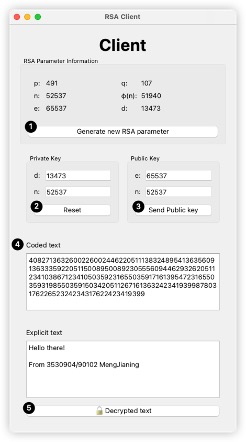
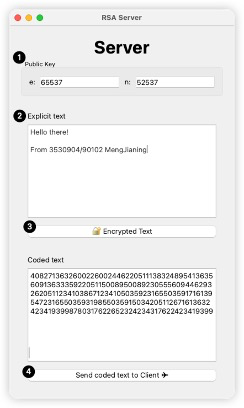

<!-- SPbSTU 报告起始 -->

  <!--  新式 π logo -->
   <!-- 研究型大学 logo -->
   
  <b>Санкт-Петербургский политехнический университет Петра Великого</b>
   
  <b>Институт компьютерных наук и технологий</b>
   
  <b>Высшая школа программной инженерии</b>

<b>基于 Qt 的 RSA 非对称加解密服务与客户端</b>

<!-- SPbSTU 报告结束 -->

[toc]

# 说明

目的是开发一个带有GUI的非对称加密消息系统，其中数据的保密性和安全性由一个自我实现的非对称加密算法来保护。

首先，这项工作需要实现一个非对称加密算法。非对称加密算法由一个公钥和一个私钥组成，其中公钥用于加密数据，私钥用于解密。

接下来的工作是在实现的非对称加密算法的基础上，开发一个以图形界面传输加密信息的系统。该系统由客户端和服务器两部分组成，服务器用公钥加密数据并将加密的数据发送给客户端，客户端用私钥解密收到的数据。

为了便于使用，使用Qt框架开发了一个GUI，这是一个跨平台的C++ GUI应用开发环境，它提供了丰富的GUI控件和工具，使开发人员能够轻松地创建跨平台的GUI应用。Qt的信号和槽机制是这个非对称加密消息系统中一个非常重要的工具。通过信号和槽机制，不同的组件可以相互交流和互动，以传输数据和处理信息。特别是，客户端和服务器之间的信息传输将使用Qt的信号和槽机制。

最后，对其进行测试和调试，以确保开发的非对称加密信息传递系统具有良好的安全性。在测试和调试过程中，必须注意保护数据的保密性和安全性，确保数据不能被未经授权的人员访问或篡改。

# GUI软件开发
## 客户端
客户端的主要功能是在RSA中生成所需的参数，并解密从服务器发回的加密文本。客户端GUI界面如下所示。

描述：
1. 点击 "生成新的RSA参数 "按钮将生成一套新的经过测试的RSA参数，这些参数显示在上表中。
2. 点击 "重置 "按钮，将 "私钥 "中的d和n重置为正确的值。
3. 当 "发送公钥 "按钮被按下时，公钥将被发送到服务器进行文本加密
4. "加密文本" 中显示服务器发送的加密文本
5. 当点击 "🔓解密文本"时，将用 "私钥" 中的d和n对加密文本进行解密，结果将显示在上面的文本区域。

## 服务端

服务端的用户界面如下图所示。我们可以看到，服务端的功能区相对简单。它只负责使用客户端发送的公钥对明文进行加密，并将加密后的文本发回给客户端。

